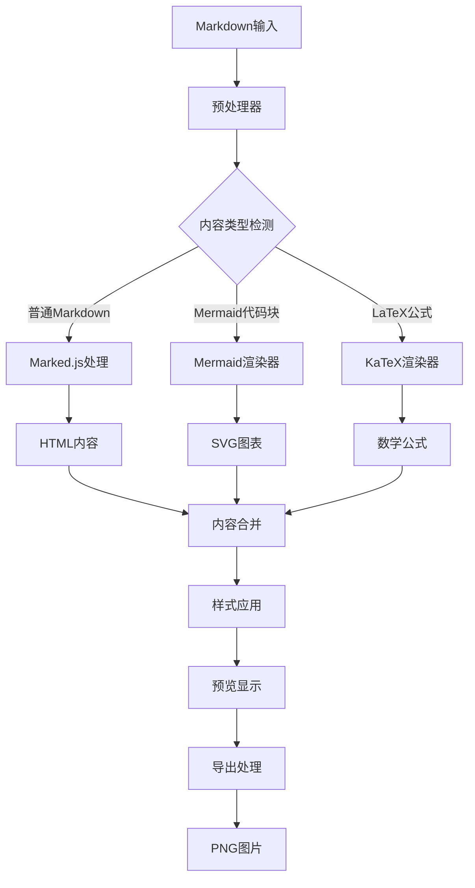

# Mermaid 流程图支持设计文档

## 技术选型

### Mermaid.js 库选择

选择 **Mermaid.js v10.6.1** 作为图表渲染引擎，理由如下：

1. **功能完整**：支持流程图、序列图、甘特图、类图等多种图表类型
2. **性能优秀**：基于 D3.js，渲染性能良好
3. **社区活跃**：GitHub 60k+ stars，维护活跃
4. **兼容性好**：与 html2canvas 兼容，支持图片导出
5. **主题支持**：内置多种主题，支持自定义样式

### 架构设计



## 核心组件设计

### 1. DiagramRenderer 类

```javascript
class DiagramRenderer {
    constructor() {
        this.isMermaidLoaded = false;
        this.diagramCounter = 0;
        this.currentTheme = 'default';
    }
    
    // 检查 Mermaid 可用性
    checkMermaidAvailability()
    
    // 渲染图表
    renderDiagram(element, diagramCode, diagramType)
    
    // 设置主题
    setTheme(theme)
    
    // 错误处理
    showDiagramError(element, errorMessage)
    
    // 预处理图表代码
    preprocessDiagram(markdown)
}
```

#### 核心方法实现

**renderDiagram 方法**：
- 生成唯一的图表 ID
- 调用 mermaid.render() 进行渲染
- 处理渲染结果和错误
- 应用自定义样式

**setTheme 方法**：
- 根据当前背景主题选择合适的 Mermaid 主题
- 动态更新图表配色方案
- 确保图表与背景的对比度

### 2. MarkdownProcessor 扩展

扩展现有的 Markdown 处理流程：

```javascript
function updatePreview() {
    const markdownText = markdownInput.value.trim();
    
    if (!markdownText) {
        showEmptyPreview();
        return;
    }
    
    // 1. 预处理数学公式
    let processedMarkdown = mathRenderer.preprocessMath(markdownText);
    
    // 2. 预处理 Mermaid 图表
    processedMarkdown = diagramRenderer.preprocessDiagram(processedMarkdown);
    
    // 3. 处理图片
    processedMarkdown = replaceImageDataForPreview(processedMarkdown);
    
    // 4. Markdown 转 HTML
    const htmlContent = marked.parse(processedMarkdown);
    posterContent.innerHTML = htmlContent;
    
    // 5. 渲染数学公式
    mathRenderer.renderMath(posterContent);
    
    // 6. 渲染图表
    diagramRenderer.renderDiagrams(posterContent);
    
    // 7. 应用样式和动画
    applyStyles();
}
```

### 3. ThemeManager 扩展

扩展主题管理器以支持图表主题：

```javascript
const diagramThemes = {
    'gradient1': 'base',
    'gradient2': 'forest',
    'gradient3': 'dark',
    'gradient4': 'default',
    'gradient5': 'neutral',
    // ... 其他主题映射
};

function applyBackground(backgroundCSS) {
    // 现有背景应用逻辑
    markdownPoster.style.background = backgroundCSS;
    
    // 更新图表主题
    const diagramTheme = diagramThemes[currentBackground] || 'default';
    diagramRenderer.setTheme(diagramTheme);
    
    // 重新渲染图表
    diagramRenderer.rerenderAll();
}
```

### 4. ExportManager 扩展

确保图表在导出时正确渲染：

```javascript
function createExactExportNode() {
    const clone = markdownPoster.cloneNode(true);
    // ... 现有克隆逻辑
    
    // 为导出节点重新渲染数学公式
    const cloneContent = clone.querySelector('.poster-content');
    if (cloneContent) {
        mathRenderer.renderMath(cloneContent);
        
        // 重新渲染图表
        diagramRenderer.renderDiagrams(cloneContent);
    }
    
    return clone;
}
```

## 数据模型

### 图表配置对象

```javascript
const mermaidConfig = {
    startOnLoad: false,
    theme: 'default',
    themeVariables: {
        primaryColor: '#6366f1',
        primaryTextColor: '#1e293b',
        primaryBorderColor: '#e2e8f0',
        lineColor: '#64748b',
        secondaryColor: '#f1f5f9',
        tertiaryColor: '#ffffff'
    },
    flowchart: {
        useMaxWidth: true,
        htmlLabels: true,
        curve: 'basis'
    },
    sequence: {
        diagramMarginX: 50,
        diagramMarginY: 10,
        actorMargin: 50,
        width: 150,
        height: 65,
        boxMargin: 10,
        boxTextMargin: 5,
        noteMargin: 10,
        messageMargin: 35
    },
    gantt: {
        titleTopMargin: 25,
        barHeight: 20,
        fontFamily: 'inherit',
        fontSize: 11,
        gridLineStartPadding: 35,
        bottomPadding: 25,
        leftPadding: 75,
        rightPadding: 25
    }
};
```

### 错误处理模型

```javascript
const DiagramError = {
    SYNTAX_ERROR: 'syntax_error',
    RENDER_ERROR: 'render_error',
    THEME_ERROR: 'theme_error',
    NETWORK_ERROR: 'network_error'
};

const errorMessages = {
    [DiagramError.SYNTAX_ERROR]: '图表语法错误，请检查 Mermaid 语法',
    [DiagramError.RENDER_ERROR]: '图表渲染失败，请稍后重试',
    [DiagramError.THEME_ERROR]: '主题应用失败，使用默认主题',
    [DiagramError.NETWORK_ERROR]: 'Mermaid 库加载失败，请检查网络连接'
};
```

## 样式设计

### CSS 变量定义

```css
:root {
    /* Mermaid 图表样式变量 */
    --mermaid-primary-color: var(--primary-color);
    --mermaid-text-color: var(--text-primary);
    --mermaid-border-color: var(--border-color);
    --mermaid-background: transparent;
    --mermaid-font-family: inherit;
    --mermaid-font-size: var(--dynamic-font-size, 16px);
}
```

### 图表容器样式

```css
.mermaid-diagram {
    margin: 1em 0;
    text-align: center;
    overflow: visible;
}

.mermaid-diagram svg {
    max-width: 100%;
    height: auto;
    font-family: var(--mermaid-font-family);
    font-size: var(--mermaid-font-size);
}

.mermaid-error {
    color: #dc2626;
    background-color: rgba(220, 38, 38, 0.1);
    padding: 12px;
    border-radius: 8px;
    border-left: 4px solid #dc2626;
    font-family: var(--font-mono);
    font-size: 0.875em;
    margin: 1em 0;
}
```

## 错误处理策略

### 1. 语法错误处理
- 捕获 Mermaid 解析错误
- 显示友好的错误信息
- 提供语法修正建议
- 不影响页面其他内容

### 2. 渲染错误处理
- 超时处理机制
- 降级到文本显示
- 错误日志记录
- 用户反馈收集

### 3. 兼容性处理
- 浏览器兼容性检测
- 功能降级方案
- 优雅的功能禁用

## 性能优化

### 1. 懒加载
- 按需加载 Mermaid 库
- 图表延迟渲染
- 减少初始加载时间

### 2. 缓存机制
- 图表渲染结果缓存
- 主题配置缓存
- 减少重复计算

### 3. 渲染优化
- 批量处理图表渲染
- 避免频繁的 DOM 操作
- 使用 requestAnimationFrame

## 测试策略

### 1. 单元测试
- DiagramRenderer 类方法测试
- 错误处理逻辑测试
- 主题切换功能测试

### 2. 集成测试
- 与 LaTeX 功能的兼容性测试
- 导出功能测试
- 性能基准测试

### 3. 用户体验测试
- 不同图表类型的渲染测试
- 错误场景的用户体验测试
- 跨浏览器兼容性测试

## 实现注意事项

1. **安全性**：确保 Mermaid 渲染不执行恶意代码
2. **性能**：控制图表复杂度，避免页面卡顿
3. **兼容性**：与现有功能保持兼容
4. **可维护性**：代码结构清晰，便于后续扩展
5. **用户体验**：错误提示友好，操作简单直观

## 扩展性考虑

1. **插件化架构**：支持自定义图表类型
2. **主题系统**：支持用户自定义图表主题
3. **API 接口**：提供图表操作的编程接口
4. **国际化**：支持多语言错误信息
5. **移动端适配**：响应式图表显示