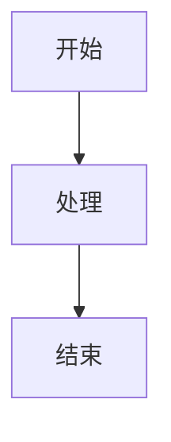

# Madopic 使用指南

## 🎯 快速上手

### 1. 启动应用
```bash
# 最简单的方式
npm run setup  # 下载依赖
npm start      # 启动服务器
```

### 2. 基本操作
1. **左侧编辑区**：输入你的 Markdown 内容
2. **右侧预览区**：实时查看渲染效果
3. **顶部工具栏**：调整样式和导出

## ✏️ 编辑 Markdown

### 基本语法
```markdown
# 标题
## 子标题

**粗体** *斜体*

- 无序列表
- 项目 1
- 项目 2

1. 有序列表
2. 项目 A
3. 项目 B

[链接](https://example.com)


> 引用文本
```

### 特殊功能

#### 数学公式
```latex
行内公式：$E = mc^2$

块级公式：
$$\int_a^b f(x) \, dx = F(b) - F(a)$$
```

#### 信息卡片
```markdown
:::card info
这是一个信息卡片
:::

:::card warning
这是一个警告卡片
:::

:::card success
这是一个成功卡片
:::
```

#### 图表 (Mermaid)


## 🎨 自定义样式

### 背景设置
1. 点击 **"背景设置"** 按钮
2. 选择 **预设背景** 或 **自定义颜色**
3. 调整 **渐变方向**

### 文字布局
1. 点击 **"文字布局"** 按钮
2. 调整 **字体大小** (12-32px)
3. 设置 **整体宽度** (480-800px)
4. 调整 **卡片边距** (20-60px)

### 显示模式
- **自由模式**：完全自定义尺寸
- **小红书模式**：3:4 比例，适合小红书
- **朋友圈模式**：长图模式，适合微信朋友圈

## 📸 导出功能

### PNG 导出
1. 点击 **"导出PNG"** 按钮
2. 等待处理完成
3. 图片自动下载

### PDF 导出
1. 点击 **"导出PDF"** 按钮
2. 选择保存位置
3. 生成矢量 PDF 文件

### HTML 导出
1. 点击 **"导出HTML"** 按钮
2. 获取可分享的 HTML 代码

## 🛠️ 工具栏功能

### 格式化工具
- **B**：粗体
- **I**：斜体
- **H**：标题
- **列表**：无序/有序列表
- **链接**：插入链接
- **图片**：插入图片

### 专业工具
- **🧮**：数学公式
- **🔬**：物理公式
- **🧪**：化学公式
- **⚛️**：质能守恒公式 E=mc²

### 图表工具
- **🔄**：流程图
- **⏭️**：序列图
- **📅**：甘特图
- **📊**：ECharts 图表

### 其他工具
- **💳**：信息卡片
- **📄**：空行
- **🗑️**：清空内容

## ⌨️ 快捷键

- `Ctrl+B` / `Cmd+B`：粗体
- `Ctrl+I` / `Cmd+I`：斜体
- `Ctrl+Z` / `Cmd+Z`：撤销
- `Ctrl+Y` / `Cmd+Y`：重做

## 💡 提示

### 图片处理
- 支持本地图片上传
- 支持网络图片链接
- 支持剪贴板粘贴图片
- 自动转换为 Base64 编码

### 性能优化
- 数学公式异步渲染
- 图表按需加载
- 图片懒加载

### 兼容性
- 支持现代浏览器
- 响应式设计
- 移动端适配

## 🔧 高级配置

### 自定义 CSS
你可以修改 `style.css` 文件来自定义样式：
```css
/* 自定义颜色 */
:root {
  --primary-color: #your-color;
}

/* 自定义字体 */
body {
  font-family: 'Your Font', sans-serif;
}
```

### 扩展功能
- 添加新的 Mermaid 图表类型
- 集成更多数学公式模板
- 自定义导出格式

---

🎉 享受使用 Madopic 创建漂亮的 Markdown 图片吧！
